<p align="center">
  
</p>

<h1 align="center">Veni AI Sustainability Cockpit</h1>

<p align="center">ERP-to-package report factory for controlled, evidence-grounded sustainability reporting.</p>

<p align="center">
  <a href="https://github.com/aliozkanozdurmus/sustainability-project/actions/workflows/ci.yml">
    
  </a>
  
  
  
  
</p>

This repository shows the current product state: connector provisioning, canonical fact sync, report generation, review, package tracking, controlled publish, and final artifact download.

Trust promise:

- No evidence, no claim.
- No calculator artifact, no numeric claim.
- No verifier pass, no publish.

## Product Intro

<a href="./output/intro.webm">
  
</a>

If your README viewer does not animate GIF previews, open [the intro GIF](./output/intro.gif) or [the original WebM clip](./output/intro.webm) directly.

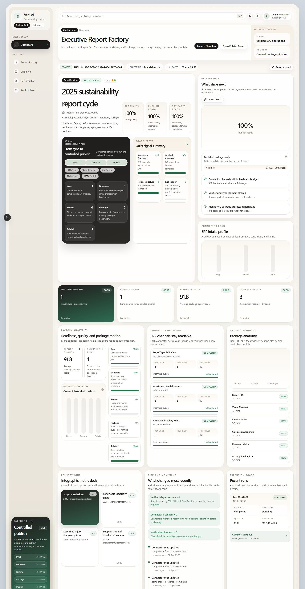

| 3 connectors                                      | 9 package stages                                                                                               | 6 tracked artifacts                                                                                                 | 17-page preview pack                                                                                              |
| ------------------------------------------------- | -------------------------------------------------------------------------------------------------------------- | ------------------------------------------------------------------------------------------------------------------- | ----------------------------------------------------------------------------------------------------------------- |
| SAP / OData, Logo Tiger / SQL View, Netsis / REST | `sync -> normalize -> outline -> write -> verify -> charts_images -> compose -> package -> controlled_publish` | `report_pdf`, `visual_manifest`, `citation_index`, `calculation_appendix`, `coverage_matrix`, `assumption_register` | Real preview assets live in `output/pdf/latest`, `output/pdf/generated`, and `output/playwright/downloads/latest` |

## Report Factory Journey

Current product flow:

`Create -> Sync -> Generate -> Review -> Package -> Controlled Publish -> Download`

`POST /runs/{id}/publish` is tracked as a package step, not as an instant PDF download shortcut. The API creates or resumes a package job, returns `package_job_id`, `package_status`, `estimated_stage`, and artifact metadata, and the final bundle is downloaded from run artifacts after package completion.


```mermaid
flowchart LR
  A[Create run] --> B[Sync connectors]
  B --> C[Generate run]
  C --> D[Review and approve]
  D --> E[Queue package job]
  E --> F[sync]
  F --> G[normalize]
  G --> H[outline]
  H --> I[write]
  I --> J[verify]
  J --> K[charts_images]
  K --> L[compose]
  L --> M[package]
  M --> N[controlled_publish]
  N --> O[Download artifacts]
```

## Product Tour

The screenshots below are current repository assets from `output/playwright/`. Some UI labels inside the product are Turkish; README copy and captions are English only.

| Dashboard                                                                                                            | New Report                                                                                |
| -------------------------------------------------------------------------------------------------------------------- | ----------------------------------------------------------------------------------------- |
|                                                                | 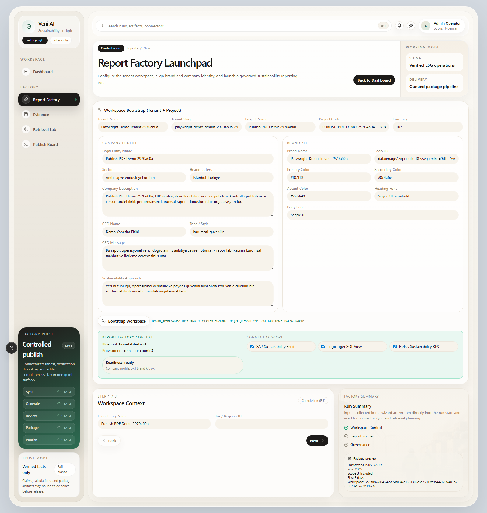                                  |
| Executive workbench for connector freshness, package lanes, verifier pressure, artifact health, and cycle readiness. | Report setup flow for blueprint version, company profile, brand kit, and connector scope. |

| Approval Center                                                                          | Evidence Center                                                                 |
| ---------------------------------------------------------------------------------------- | ------------------------------------------------------------------------------- |
|                        | 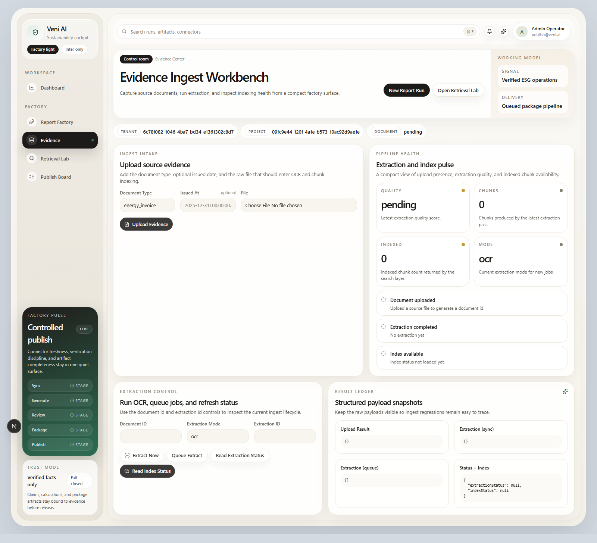              |
| Controlled publish board for run queue, approvals, package status, and artifact actions. | Ingest workbench for document upload, extraction quality, and source inventory. |

| Retrieval Lab                                                                                       |
| --------------------------------------------------------------------------------------------------- |
| 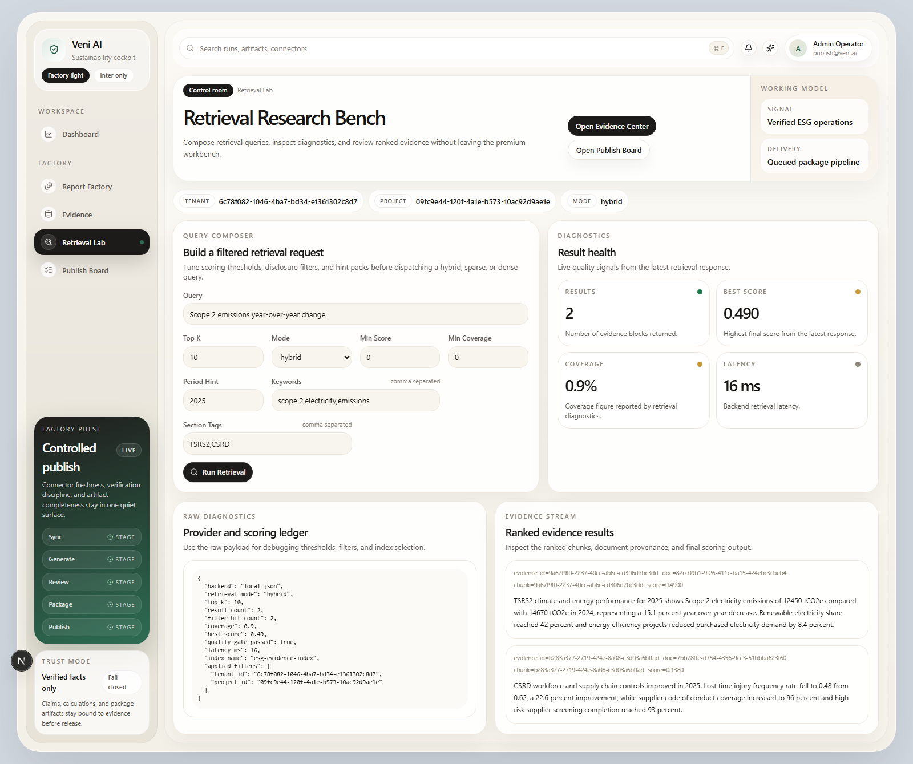                                      |
| Evidence search surface for diagnostics, scoring, filters, and retrieval inspection before publish. |

<details>
<summary>Controlled publish smoke sequence</summary>

| 1. New Report                                                                         | 2. After Execute                                                                            |
| ------------------------------------------------------------------------------------- | ------------------------------------------------------------------------------------------- |
| 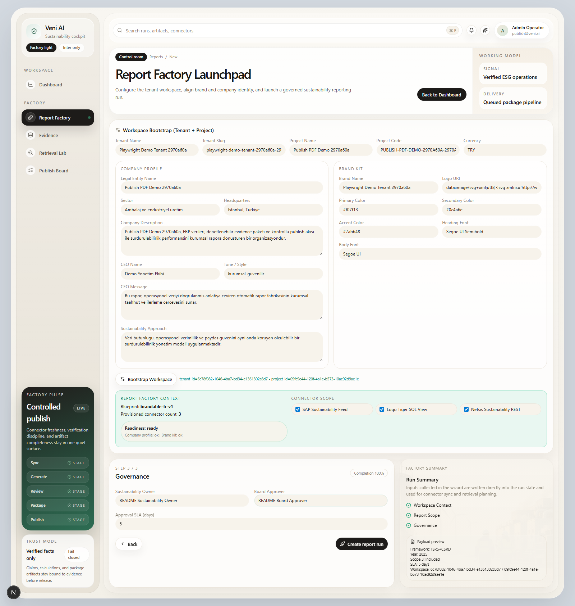 | 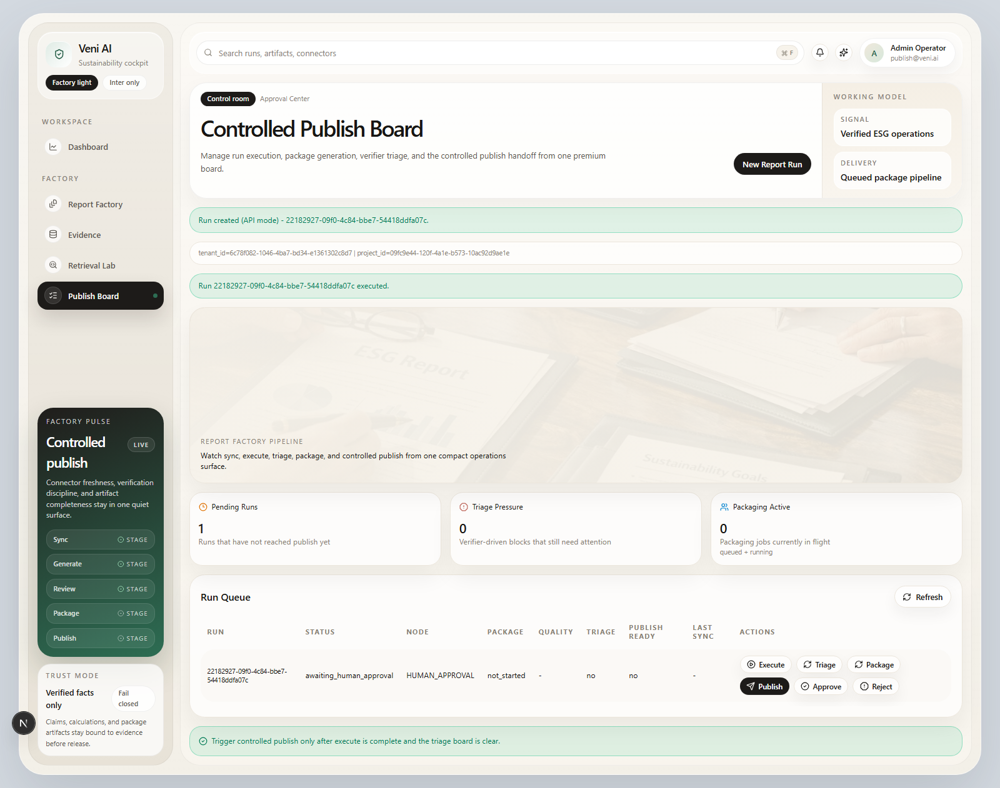 |
| The operator starts a run with demo workspace data and report context.                | The run completes execution and moves into reviewable state.                                |

| 3. After Approve                                                                            | 4. After Publish                                                                            |
| ------------------------------------------------------------------------------------------- | ------------------------------------------------------------------------------------------- |
| 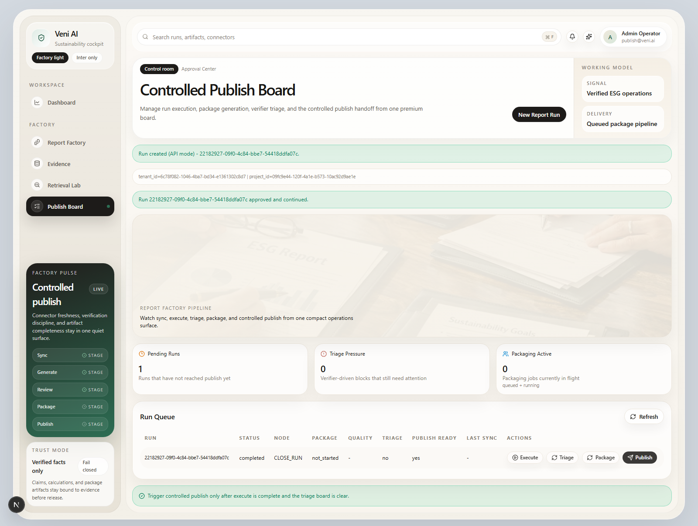 | 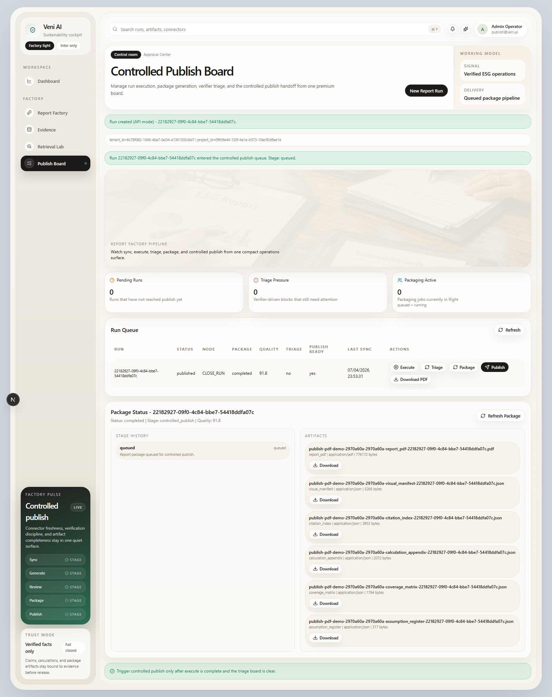 |
| Review is complete and the run is ready for controlled publish.                             | Package creation is complete and the final artifact becomes downloadable.                   |

</details>

## Generated Report Output

The repository includes real generated report assets, not README mockups. The preview band below is sourced from `output/pdf/latest/`, and the downloadable preview files are stored in `output/pdf/generated/` and `output/playwright/downloads/latest/`.

| Cover                                              | Contents                                           | Narrative                                          |
| -------------------------------------------------- | -------------------------------------------------- | -------------------------------------------------- |
| 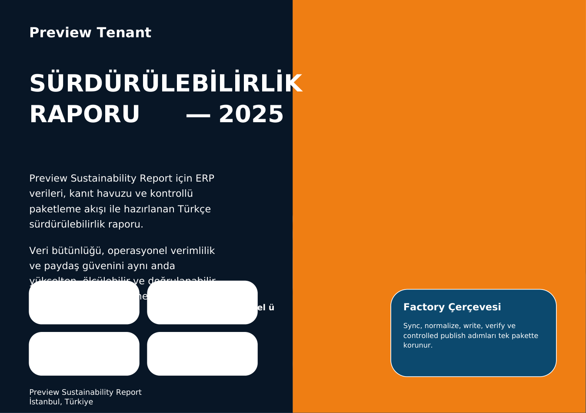 | 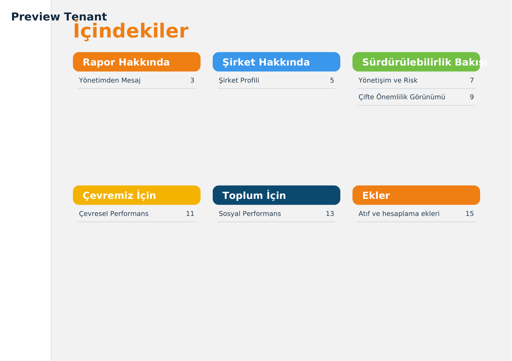 | 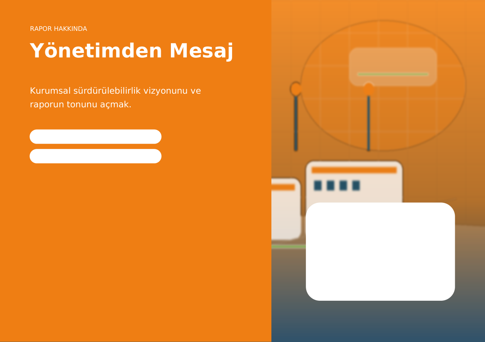 |

| Governance / ESG                                   | Operational spread                                 | Appendix / traceability                            |
| -------------------------------------------------- | -------------------------------------------------- | -------------------------------------------------- |
| 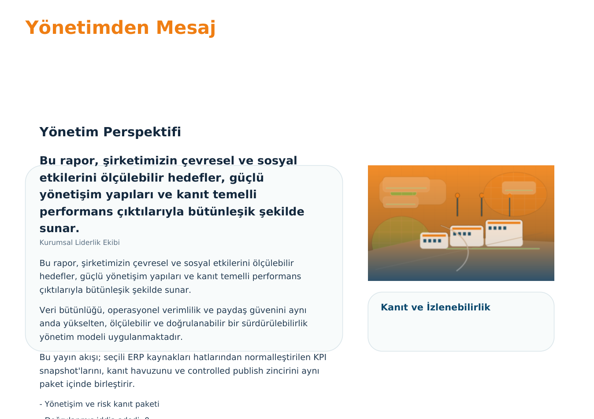 | 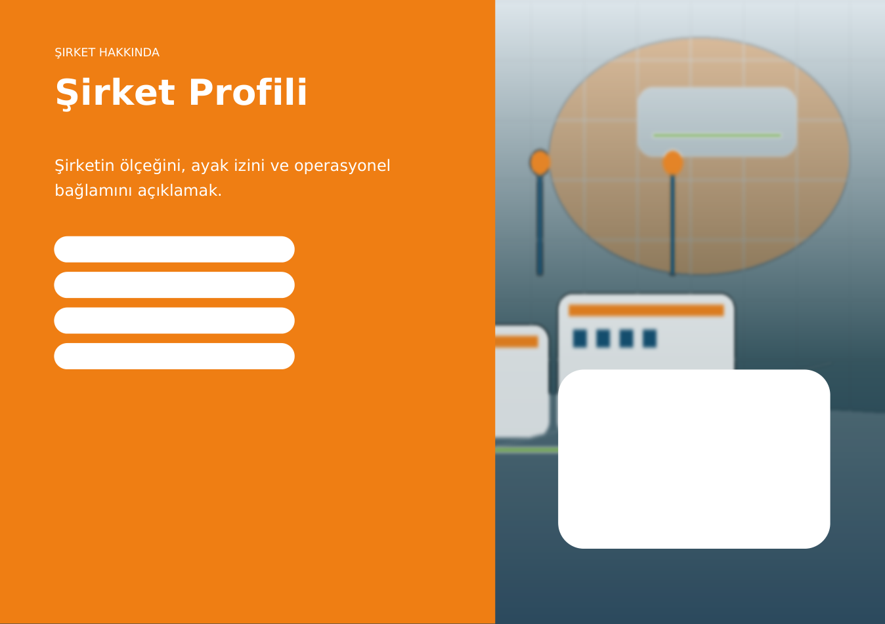 | 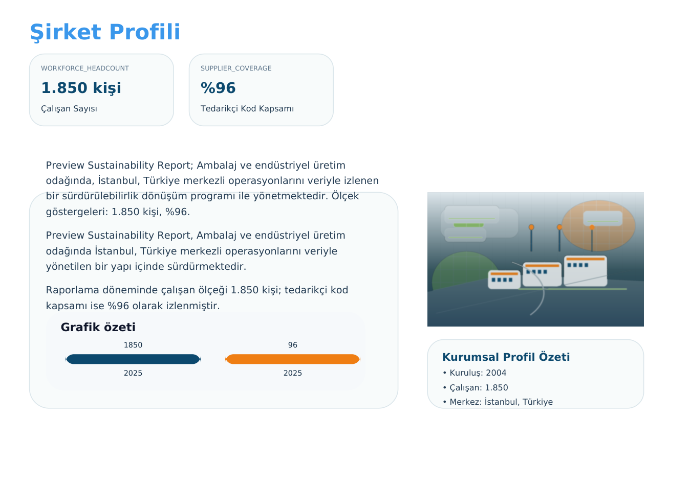 |

Repository PDF assets:

- [Preview package PDF](./output/pdf/generated/report-factory-preview.pdf) - 17 pages, 1.21 MB.
- [Manual smoke downloaded PDF](./output/playwright/downloads/latest/manual-smoke-report.pdf) - 24 pages, 758.0 KB.
- [Manual smoke summary](./output/playwright/manual-smoke/latest/manual-smoke-summary.json) - run id, file path, file size, and screenshot evidence.

## Connector Matrix

The current connector layer provisions three ERP-facing inputs and normalizes them into one canonical fact shape before the package pipeline consumes them.

| Connector             | Ingest method               | Delta tracking         | Example metrics in repo                                                           | Normalized destination                    |
| --------------------- | --------------------------- | ---------------------- | --------------------------------------------------------------------------------- | ----------------------------------------- |
| SAP / OData           | OData pull                  | `delta_token`          | `E_SCOPE2_TCO2E`, `RENEWABLE_ELECTRICITY_SHARE`, `BOARD_OVERSIGHT_COVERAGE`       | `canonical_facts` feeding `kpi_snapshots` |
| Logo Tiger / SQL View | Read-only SQL view snapshot | `snapshot_watermark`   | `WORKFORCE_HEADCOUNT`, `LTIFR`, `SUSTAINABILITY_COMMITTEE_MEETINGS`               | `canonical_facts` feeding `kpi_snapshots` |
| Netsis / REST         | REST pull                   | `cursor_or_updated_at` | `SUPPLIER_COVERAGE`, `MATERIAL_TOPIC_COUNT`, `STAKEHOLDER_ENGAGEMENT_TOUCHPOINTS` | `canonical_facts` feeding `kpi_snapshots` |

Canonical fact contract highlights:

```json
{
  "metric_code": "E_SCOPE2_TCO2E",
  "period_key": "2025",
  "unit": "tCO2e",
  "value_numeric": 12450.0,
  "source_system": "sap_odata",
  "source_record_id": "sap-scope2-2025",
  "owner": "energy@company.local",
  "confidence_score": 0.98,
  "trace_ref": "sap://scope2/2025"
}
```

Key integration surfaces:

| Surface                                | Purpose                                                      |
| -------------------------------------- | ------------------------------------------------------------ |
| `POST /integrations/connectors`        | Create or update an integration configuration for a project. |
| `POST /integrations/sync`              | Run connector sync and materialize normalized facts.         |
| `GET /integrations/sync-jobs/{job_id}` | Inspect sync status, counters, cursors, and diagnostics.     |
| `GET /projects/{project_id}/facts`     | Read normalized project facts after sync.                    |

## Trust Architecture

The current product is intentionally fail-closed.

| Rule                                     | What it means in the product                                               | Where it shows up                                                         |
| ---------------------------------------- | -------------------------------------------------------------------------- | ------------------------------------------------------------------------- |
| No evidence, no claim                    | Claims must carry citation refs before they are package-eligible.          | Review flow, citation index, package gate.                                |
| No calculator artifact, no numeric claim | Numeric statements must resolve to calculation artifacts.                  | Calculation appendix and publish gate.                                    |
| No verifier pass, no publish             | Critical `FAIL` and unresolved verification issues block publish.          | Approval center and `POST /runs/{id}/publish`.                            |
| Controlled publish only                  | Publish returns tracked package metadata instead of a blind file response. | `package_job_id`, `package_status`, `estimated_stage`, and stage polling. |
| Artifact manifest                        | Every completed bundle exposes typed artifact records and download paths.  | Run package status and artifact endpoints.                                |

Decorative visuals are also tracked rather than silently embedded. The report factory records visual slots in a `visual_manifest`, marks whether an asset was AI-generated, and falls back to deterministic editorial visuals when image generation is unavailable or disabled.

## Runtime Surfaces

These are the high-level surfaces a product evaluator, technical buyer, or contributor can inspect quickly:

| Surface                                        | What it returns                                                                                                 |
| ---------------------------------------------- | --------------------------------------------------------------------------------------------------------------- |
| `GET /dashboard/overview?tenant_id&project_id` | Hero summary, KPI strip, connector health, pipeline lanes, verifier risk, activity, and schedule blocks.        |
| `POST /runs`                                   | Creates a run with `report_blueprint_version`, `company_profile_ref`, `brand_kit_ref`, and `connector_scope[]`. |
| `POST /runs/{run_id}/publish`                  | Queues or resumes the package pipeline and returns package tracking metadata.                                   |
| `GET /runs/{run_id}/package-status`            | Returns `package_status`, `current_stage`, `stage_history`, `visual_generation_status`, and tracked artifacts.  |
| `GET /runs/{run_id}/artifacts/{artifact_id}`   | Downloads the final PDF or supporting JSON artifacts for the run.                                               |

## System Architecture

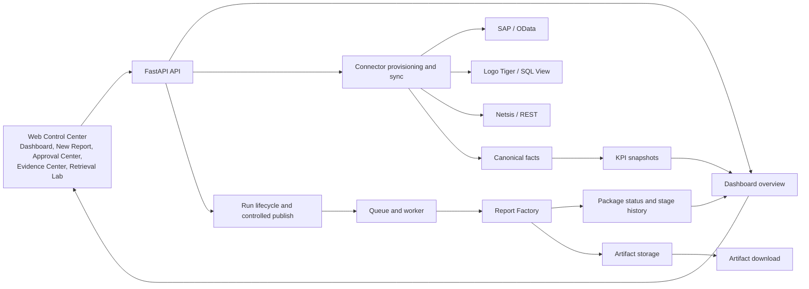
```mermaid
flowchart LR
  Web[Web Control Center<br/>Dashboard, New Report, Approval Center,<br/>Evidence Center, Retrieval Lab] --> API[FastAPI API]
  API --> Overview[Dashboard overview]
  API --> Integrations[Connector provisioning and sync]
  API --> Runs[Run lifecycle and controlled publish]

  Integrations --> SAP[SAP / OData]
  Integrations --> Logo[Logo Tiger / SQL View]
  Integrations --> Netsis[Netsis / REST]

  Integrations --> Facts[Canonical facts]
  Facts --> Kpis[KPI snapshots]

  Runs --> Queue[Queue and worker]
  Queue --> Factory[Report Factory]
  Factory --> Tracking[Package status and stage history]
  Factory --> Storage[Artifact storage]

  Overview --> Web
  Kpis --> Overview
  Tracking --> Overview
  Storage --> Download[Artifact download]
```

## Package Anatomy

Every completed package is discoverable through the run status payload and downloadable artifact links.

| Artifact               | Format | Purpose                                                              |
| ---------------------- | ------ | -------------------------------------------------------------------- |
| `report_pdf`           | PDF    | Final report package with bookmarks, metadata, and report narrative. |
| `visual_manifest`      | JSON   | Visual slot inventory with source type and AI-generation flags.      |
| `citation_index`       | JSON   | Claim-to-evidence traceability export.                               |
| `calculation_appendix` | JSON   | Numeric calculation references and appendix content.                 |
| `coverage_matrix`      | JSON   | Section coverage view across required metrics and appendix refs.     |
| `assumption_register`  | JSON   | Package assumptions captured during generation.                      |

Package status payload highlights:

- `package_job_id`
- `package_status`
- `current_stage`
- `stage_history`
- `report_quality_score`
- `visual_generation_status`
- `artifacts[]`

## Quick Start

Create the single local runtime file at the repository root by copying `/.env.example` to `/.env`.
The root `/.env` is the only file-based env source for local API, worker, Next.js, and Playwright runs.

Start the full local stack with Docker:

```bash
docker compose up --build
```

Local service URLs:

- Web: `http://localhost:3000`
- API: `http://localhost:8000`
- API docs: `http://localhost:8000/docs`
- API readiness: `http://localhost:8000/health/ready`

Useful repo commands:

```bash
pnpm lint
pnpm typecheck
pnpm test
pnpm build
pnpm e2e
pnpm e2e:manual-smoke
pnpm contracts:sync
```

Playwright automation is organized under `apps/web/e2e/`, with `specs/` for smoke coverage, `scripts/` for environment bootstrap and runners, and repo-root artifacts written to `output/playwright/`.

What the Docker stack brings up:

- Next.js web app
- FastAPI API
- ARQ worker
- PostgreSQL
- Redis

## Verification Notes

This README is intentionally grounded in current repository behavior:

- Intro animation points to `output/intro.gif`, with the original source clip preserved at `output/intro.webm`.
- Asset links point to files that already exist under `output/playwright/`, `output/pdf/latest/`, `output/pdf/generated/`, and `output/playwright/downloads/latest/`.
- Package stage names match the current report factory service exactly.
- Connector names, delta semantics, and artifact names match the current API and backend services.
- The old "publish and instantly download PDF" story is intentionally removed in favor of tracked package status and artifact download.

## Deeper Docs

<details>
<summary>Open supporting documentation</summary>

- [AGENTS.md](./AGENTS.md)
- [Architecture baseline](./docs/architecture/public-baseline.md)
- [Docker development runbook](./docs/runbooks/docker-development.md)
- [E2E development runbook](./docs/runbooks/e2e-development.md)
- [Runtime configuration](./docs/configuration/runtime-configuration.md)
- [Secrets policy](./docs/security/secrets-policy.md)
- [Contributing guide](./CONTRIBUTING.md)

</details>

## License

[MIT](./LICENSE)
